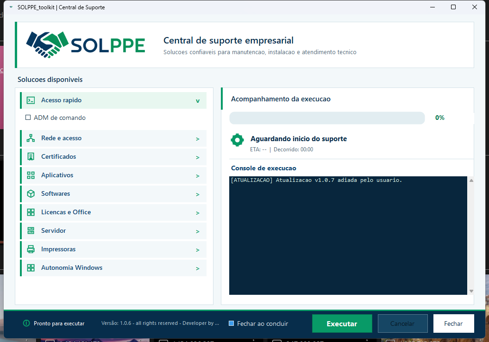

<div align="center">

# SOLPPE Toolkit

**Central de suporte e automação para ambientes Windows**

Solução Parceira Para Empresas

[](gui/ToolkitAllGui.cs)
[](toolkit_all.ps1)
[](#)
[](https://github.com/Nata-Felix/SOLPPE-Toolkit/releases/latest)

</div>

O **SOLPPE Toolkit** concentra tarefas recorrentes de suporte técnico em uma interface única. O objetivo é reduzir etapas manuais, padronizar atendimentos e dar mais previsibilidade a instalações, reparos e configurações de estações Windows.



## O que o projeto resolve

- Configuração de rede, DHCP, IP fixo, DNS, TLS e compartilhamentos.
- Mapeamento de sistemas e preparação de credenciais de rede.
- Instalação de certificados e validação de conectividade com a SEFAZ.
- Instalação assistida de impressoras e remoção independente de drivers.
- Reinstalação e recuperação do Firebird.
- Instalação de dependências como .NET e Crystal Reports.
- Reparos do Windows, Windows Update, spooler e portas COM.
- Acesso rápido a ferramentas oficiais de atendimento remoto.
- Assistente para migração de servidor.

## Diferenciais técnicos

- Interface WinForms em C# com execução acompanhada e logs visíveis.
- Ações administrativas isoladas e orquestradas por PowerShell.
- Downloads a partir de fontes oficiais ou assets controlados em Releases.
- Catálogo versionado de drivers de impressora.
- Atualização automática com validação SHA-256 antes da substituição do executável.
- Recuperação da versão anterior em caso de falha na atualização.

## Componentes

```text
gui/ToolkitAllGui.cs   Interface e orquestração
gui/SolppeUpdater.cs   Atualizador seguro
toolkit_all.ps1        Biblioteca de ações de suporte
instalar.ps1           Instalação de dependências
gui/build.ps1          Compilação dos executáveis
```

## Download

Os executáveis oficiais ficam em [Releases](https://github.com/Nata-Felix/SOLPPE-Toolkit/releases):

- `SOLPPE_toolkit.exe`: aplicativo principal.
- `SOLPPE_updater.exe`: atualizador automático.

## Compilação

No Windows:

```powershell
powershell -NoProfile -ExecutionPolicy Bypass -File .\gui\build.ps1
```

## Segurança operacional

Algumas ações alteram configurações administrativas do Windows. O operador deve revisar as opções selecionadas e confirmar que elas são adequadas ao ambiente antes da execução.

## Sobre a SOLPPE

**SOLPPE** significa **Solução Parceira Para Empresas**. A marca identifica ferramentas criadas para transformar problemas operacionais em fluxos simples, repetíveis e confiáveis.
